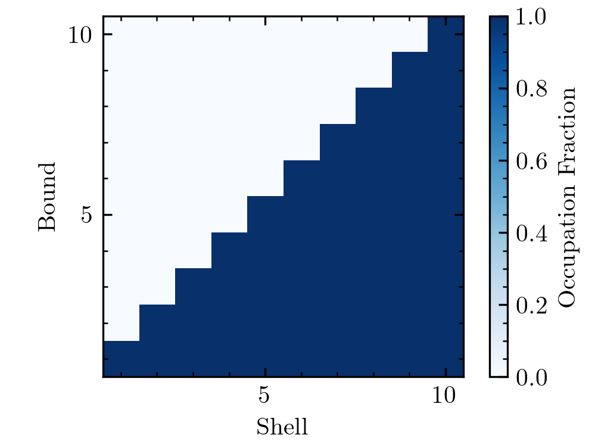
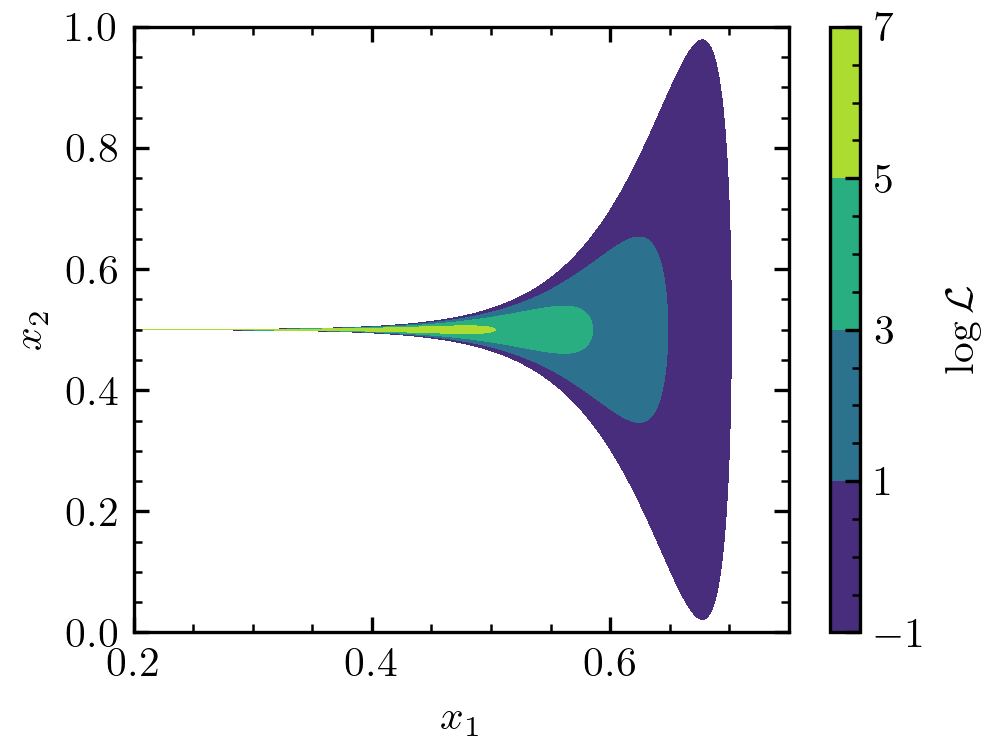
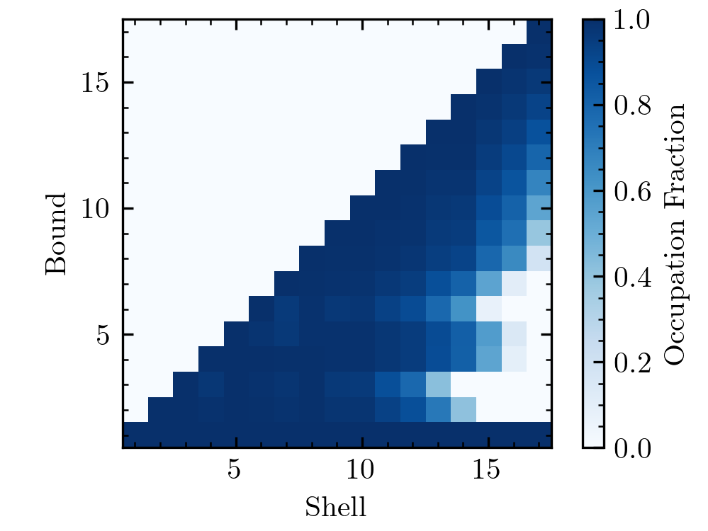

Convergence
===========

Like every Bayesian sampler, nautilus can produce biased results. Therefore, it is crucial for science applications to ensure that the relevant results are sufficiently converged. Note that the term convergence should not be confused with the stopping criterion, i.e., the conditions under which the algorithm stops proposing new points. The latter will almost always be fulfilled but does not guarantee convergence in the sense of getting accurate, unbiased results. The above argument also holds for other Nested Sampling (NS) algorithms such as dynesty, UltraNest, and MultiNest.

As for NS algorithms, one of the best ways to assess convergence is to repeat runs with different hyper-parameters for the sampler. As for NS algorithms, an excellent hyper-parameter to vary is the number of live points. It is good practice to increase the number of live points by a factor of a few and check that the results are stable. Additionally, the posterior mustn't be under-sampled since this leads to noisy results and can result in parts of the posterior being systematically missed. We recommend always running nautilus until reaching an effective size of at least 10,000.

Shell-Bound Occupation
----------------------

Although we recommend always checking convergence by varying hyper-parameters, there is a helpful statistic one can use as a screening tool for convergence. Nautilus works by drawing many bounds :math:`B_i` that are approximations to the part of parameter space where :math:`\log \mathcal{L} > \log \mathcal{L}_{{\rm min}, i}` with :math:`\log \mathcal{L}_{{\rm min}, i}` increasing with :math:`i`. If nautilus does a really good job at approximating these boundaries, then bound :math:`B_i` should be a subset of :math:`B_k` for all :math:`i > k`. We can check whether this is (approximately) true. Let's define the so-called shell :math:`S_i` as the part of parameter space covered by :math:`B_i` but no subsequent bound :math:`B_k` with :math:`k > i`. We can calculate for each shell :math:`B_i`, what fraction of points in that shell are part of lower bound :math:`B_k`, i.e. :math:`k < i`. Ideally, this fraction is always unity. (By definition, no point belonging to :math:`S_i` is part of higher-order bounds :math:`B_k` with :math:`k>i`.)

Let's compute with :py:meth:`nautilus.Sampler.shell_bound_occupation` and visualize this statistic. First, we choose a straightforward problem that nautilus should solve well, a two-dimensional Gaussian.

.. code-block:: python

    import numpy as np
    import matplotlib.pyplot as plt
    from matplotlib.ticker import MultipleLocator
    from nautilus import Sampler
    from scipy.stats import multivariate_normal

    def prior(x):
        return x

    def likelihood(x):
        return multivariate_normal.logpdf(x, mean=np.repeat(0.5, 2), cov=0.01)

    sampler = Sampler(prior, likelihood, n_dim=2)
    sampler.run(verbose=True)
    occ = sampler.shell_bound_occupation()

    plt.imshow(occ.T, origin='lower', cmap='Blues',
               extent=(0.5, len(occ) + 0.5, 0.5, len(occ) + 0.5))
    plt.gca().xaxis.set_minor_locator(plt.MultipleLocator(1))
    plt.gca().yaxis.set_minor_locator(plt.MultipleLocator(1))
    plt.xlabel('Shell')
    plt.ylabel('Bound')
    cb = plt.colorbar()
    cb.set_label('Occupation Fraction')

As expected, the occupation fraction is unity for all :math:`S_i` and :math:`B_k` with :math:`i > k`.

Next, we will choose a much more challenging problem, a funnel distribution.

.. code-block:: python

    from scipy.stats import norm

    def likelihood(x):
        return (norm.logpdf(x[0], loc=0.5, scale=0.1) +
                norm.logpdf(x[1], loc=0.5, scale=np.exp(20 * (x[0] - 0.5)) / 100))

Let's first visualize the function to check why it is so difficult.

.. code-block:: python

    x1 = np.linspace(0.2, 0.75, 10000)
    x2 = np.linspace(0, 1, 10000)
    X1, X2 = np.meshgrid(x1, x2)
    log_l = [likelihood([x1, x2]) for x1, x2 in zip(X1, X2)]

    plt.contourf(X1, X2, log_l, np.linspace(-1, +7, 5))
    plt.xlabel(r"$x_1$")
    plt.ylabel(r"$x_2$")
    cb = plt.colorbar()
    cb.set_label(r"$\log \mathcal{L}$")

We can see that the likelihood levels have a trumpet shape. There's much more volume for every likelihood level at :math:`x_1 > 0.5`. However, the highest likelihood regions occur at :math:`x_1 < 0.5`. One can show that the posterior mass is roughly equally split between :math:`x_1 < 0.5` and :math:`x_1 > 0.5`. The problem is that, for example, any random sampling of the space with :math:`\log \mathcal{L} > -1` is extremely unlikely to return a point with :math:`x_1 < 0.5`. Thus, nautilus will also have a hard time figuring out the :math:`\log \mathcal{L} > -1` parameter space and likely miss parts at :math:`x_1 < 0.5`. However, as the likelihood threshold increases, nautilus will start to explore this part of the parameter space. Here's what the occupation fractions look like.

As expected, part of the high-likelihood space that nautilus explores in later iterations is missed in early iterations. This example shows how the occupation plot can signal whether a likelihood is difficult. However, the fact that part of the high-likelihood space is missed in early iterations does not mean that the results by nautilus are biased. As long as they're explored in later iterations, there should not be a problem. In fact, nautilus was tested extensively with the funnel distribution (Lange, in prep.) and found to give unbiased results even for a large number of dimensions. Nonetheless, if the occupation plot looks like the above, this certainly warrants further convergence studies.

Pseudo-Importance Bias
----------------------

As described in the nautilus paper (Lange, in prep.), using points sampled during the initial exploration phase incurs a slight, most often negligible bias in the posterior and evidence estimates due to the use of a pseudo-importance function. This bias can be entirely removed by discarding points obtained during the exploration phase. To do this, add ``discard_exploration=True`` to :py:meth:`nautilus.Sampler.run`. We recommend always doing this when using nautilus for publications.
