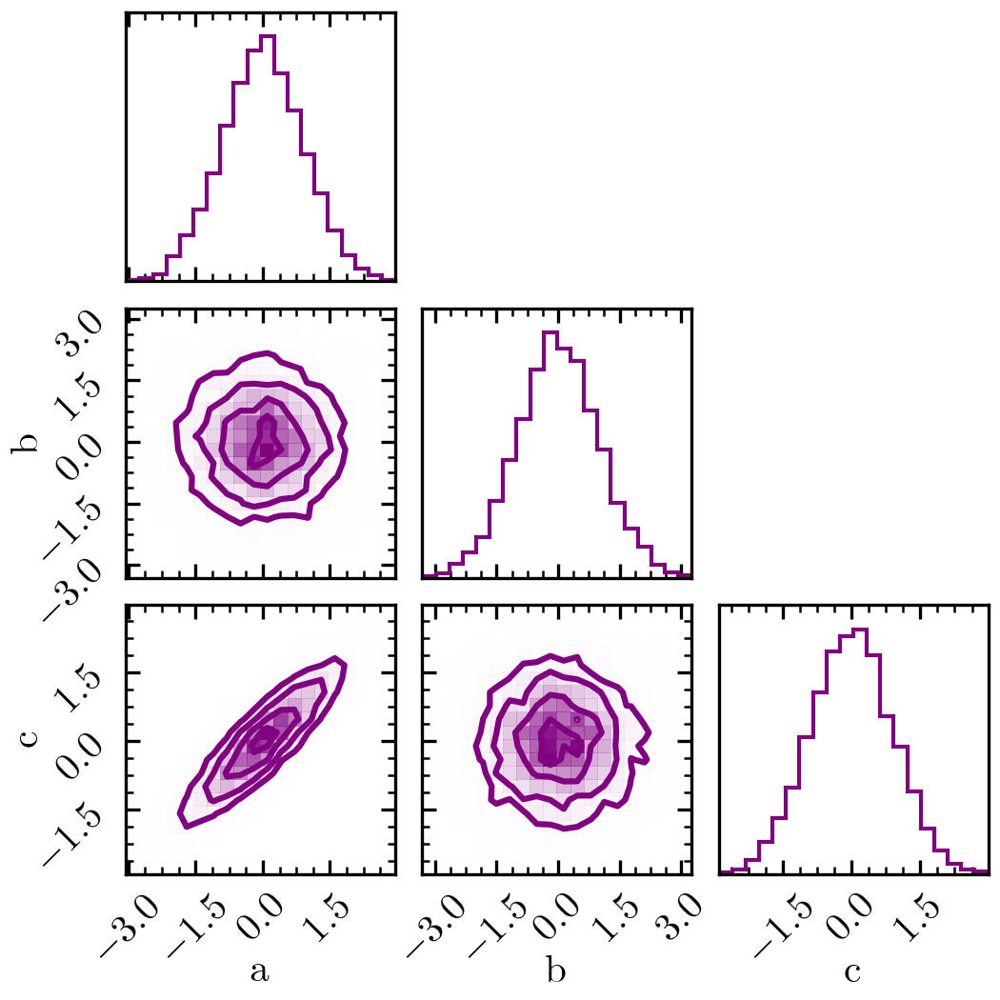

Quickstart
==========

The best way to get started with ``nautilus`` is to apply it to a problem. Here, we give a minimal example of using the code to estimate parameter posteriors and the Bayesian evidence :math:`\mathcal{Z}`. In this example, our "model" has three parameters: :math:`a`, :math:`b` and :math:`c`. Furthermore, let's assume flat priors for :math:`a` and :math:`b` in the range :math:`[-5, +5]` and a Gaussian prior for :math:`c` with :math:`0` mean and :math:`2` scatter. The priors can be specified as follows.

.. code-block:: python

    from scipy.stats import norm
    from nautilus import Prior

    prior = Prior()
    prior.add_parameter('a', dist=(-5, +5))
    prior.add_parameter('b', dist=(-5, +5))
    prior.add_parameter('c', dist=norm(loc=0, scale=2.0))

The next step is to define the likelihood. For simplicity, let's assume that all three parameters have zero mean and unit variance but that :math:`a` and :math:`c` have a correlation coefficient of :math:`0.9`.

.. code-block:: python

    import numpy as np
    from scipy.stats import multivariate_normal

    def likelihood(param_dict):
        x = np.array([param_dict['a'], param_dict['b'], param_dict['c']])
        return multivariate_normal.logpdf(
            x, mean=np.zeros(3), cov=[[1, 0, 0.90], [0, 1, 0], [0.90, 0, 1]])

Now, we are ready to run the sampler.

.. code-block:: python

    from nautilus import Sampler

    sampler = Sampler(prior, likelihood, n_live=1000)
    sampler.run(verbose=True)

With ``verbose=True``, the sample will give updates on the status. The output will look something like this.

.. code-block::

    Starting the nautilus sampler...
    Please report issues at github.com/johannesulf/nautilus.
    Status    | Bounds | Ellipses | Networks | Calls    | f_live | N_eff | log Z 
    Computing | 7      | 1        | 4        | 15600    | 0.3454 | 8039  | +0.01

The status is either computing the likehihoods (Computing), sampling new points from boundaries (Sampling), or creating new bounds (Bounding). The subsequent entries show the total number of bounds, the number of ellipsoids in the latest bound, the number of neural networks in the latest bound, the total number of likelihood evaluations, the fractional evidence in the live set, the effective sample size and the natural log of the evidence. Once the algorithm is finished, we can plot the posterior using the handy corner Python package.

.. code-block:: python

    import corner
    import matplotlib.pyplot as plt

    points, log_w, log_l = sampler.posterior()
    corner.corner(
        points, weights=np.exp(log_w), bins=20, labels=prior.keys, color='purple',
        plot_datapoints=False, range=np.repeat(0.999, len(prior.keys)))

The Bayesian evidence :math:`\log \mathcal{Z}` was also estimated during the run.

.. code-block:: python

    print('log Z: {:.2f}'.format(sampler.log_z))

Output::

    log Z: -6.34
