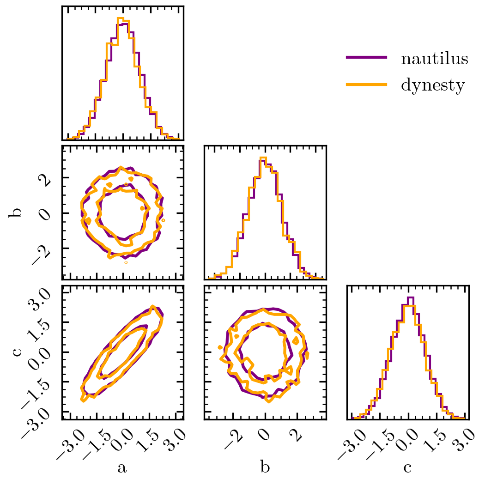

Dynesty Users
=============

If you're already familiar with using ``dynesty`` for Baysian posterior and
evidence estimation, this guide will be helpful. Here, we describe the major
differences and similarities between ``dynesty`` and ``nautilus`` and how you
can easily adapt your code from ``dynesty`` to ``nautilus``.

Algorithm Differences
---------------------

The primary goals of ``dynesty`` and ``nautilus`` are identical: identify the
parts of parameter space with the highest likelihood, sample points from the
parameter posterior, and estimate the Bayesian evidence. Additionally,
``dynesty`` and ``nautilus`` work in very similar ways during the initial
exploration of the parameter space. Both randomly sample the prior space,
identify the points with the highest likelihood, the so-called live set, and
then estimate a boundary around the live set. Afterward, points are sampled
from within the live set boundary and then a new live set with a higher minimum
likelihood is identified. This procedure, sampling from within a live set
boundary and identifying a new live set, is repeated until a convergence
criterion is reached and leads to a live set that rapidly shrinks to the
maximum likelihood value.

A major difference between ``dynesty`` and ``nautilus`` is the way the live set
boundary is drawn. In particular, unlike ``dynesty``, ``nautilus`` uses a
neural network-based algorithm to determine efficient boundaries. Furthermore,
``dynesty`` and ``nautilus`` differ significantly in how the Bayesian
posterior and evidence are estimated after this initial exploration phase.
``dynesty`` is built on the nested sampling algorithm (`Skilling 2006
<https://doi.org/10.1214%2F06-BA127>`_) whereas ``nautilus`` is an importance
sampling algorithm. Another big difference is how more posterior samples can be
added and the evidence refined after the exploration phase. ``dynesty`` uses
separate nested sampling runs that are later combined for that. On the other
hand, ``nautilus`` uses the information on the likelihood obtained during the
exploration phase to more or less directly sample from the posterior to obtain
more posterior samples or refine the evidence estimate.

API Differences
---------------

``dynesty`` and ``nautilus`` use very similar APIs with the explicit goal to
make the transition as easy as possible. The following is a simple example
based on the :doc:`crash coure <crash_course>`. First, let us define the
problem.

.. code-block:: python

    import numpy as np
    from scipy.stats import norm
    from scipy.stats import multivariate_normal

    n_dim = 3

    def prior(u):
        return np.array(
            [u[0] * 10 - 5, u[1] * 10 - 5, norm(loc=0, scale=2.0).ppf(u[2])])

    def likelihood(x):
        return multivariate_normal.logpdf(
            x, mean=np.zeros(3), cov=[[1, 0, 0.90], [0, 1, 0], [0.90, 0, 1]])

Here's how we apply ``dynesty`` and ``nautilus`` to this problem.

.. code-block:: python

    samples = {}
    log_w = {}
    log_z = {}

    import dynesty import NestedSampler

    sampler = NestedSampler(likelihood, prior, n_dim)
    sampler.run_nested()

    samples['dynesty'] = sampler.results.samples
    log_w['dynesty'] = sampler.results.logwt
    log_z['dynesty'] = sampler.results.logz[-1]

    from nautilus import Sampler

    sampler = Sampler(prior, likelihood, n_dim, n_live=1000)
    sampler.run(verbose=True)
    samples['nautilus'], log_w['nautilus'] = sampler.posterior()[:2]
    log_z['nautilus'] = sampler.evidence()

We see that the main results agree well with each other.

.. code-block:: python

    import corner
    import matplotlib.pyplot as plt

    fig, axes = plt.subplots(n_dim, n_dim, figsize=(3.5, 3.5))
    for sampler, color in zip(['nautilus', 'dynesty'], ['purple', 'orange']):
        corner.corner(samples[sampler], weights=np.exp(log_w[sampler]), bins=20,
                      labels=['a', 'b', 'c'], plot_datapoints=False,
                      plot_density=False, fill_contours=False, levels=(0.68, 0.95),
                      range=np.ones(n_dim) * 0.999, color=color, fig=fig)
        axes[0, 2].plot(0, 0, label=sampler, color=color)

    axes[0, 2].legend(loc='center', frameon=False)

    print('Evidence: {:.1f} vs. {:.1f}'.format(
        log_z['nautilus'], log_z['dynesty']))

Output::

    Evidence: -6.3 vs. -6.3

Check out the :doc:`API documentation <../api>` for a more in-depth
documentation of how to run ``nautilus``. In many cases, the basic arguments to
run ``nautilus`` are the same or very similar to ``dynesty``.

General Advice
--------------

``nautilus`` profits from more live points! We do not recommend running
``nautilus`` with less than 1000 live points. Although the runtime of the
algorithm is, in principle, proportional to the number of live points, the
increased sampling efficiency with more points more than makes up for that.
Often, ``nautilus`` with 3000 live points runs faster than ``dynesty`` with
500.
