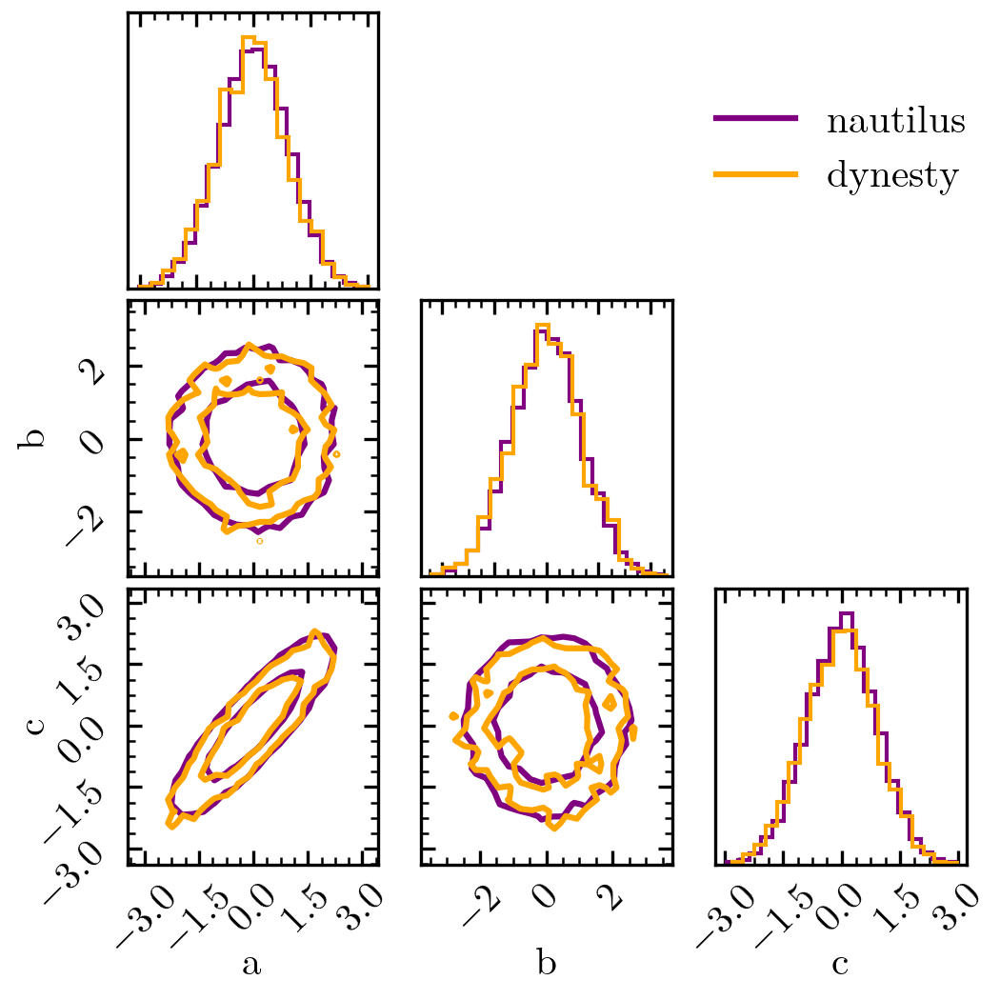

Nested Sampling
===============

If you're already familiar with nested sampling (NS) codes such as ``dynesty``, ``pymultinest`` or ``ultranest``, this guide should be helpful. Here, we describe the key differences and similarities between NS codes and ``nautilus`` and how you can quickly adapt your existing code to ``nautilus``.

Algorithm Differences
---------------------

The primary goals of nested sampling and ``nautilus`` are identical: identify the parts of parameter space with the highest likelihood, sample points from the parameter posterior, and estimate the Bayesian evidence. Additionally, nested sampling and ``nautilus`` work similarly during initial parameter space exploration. Both randomly sample the prior space, identify the points with the highest likelihood, the so-called live set, and then estimate a boundary around the live set. Afterward, points are sampled from within the live set boundary, and a new live set with a higher minimum likelihood is identified. This procedure, sampling from within a live set boundary and identifying a new live set, is repeated until a convergence criterion is reached and leads to a live set that rapidly shrinks to the maximum likelihood value.

A key difference between ``dynesty``/``pymultinest``/``ultranest`` and ``nautilus`` is how the live set boundary is drawn. In particular, unlike the NS codes mentioned above, ``nautilus`` uses a neural network-based algorithm to determine efficient boundaries. Furthermore, NS codes and ``nautilus`` differ significantly in how the Bayesian posterior and evidence are estimated after this initial exploration phase. In particular, ``nautilus`` uses an Importance Nested Sampling (INS) algorithm, not NS. Another big difference between ``nautilus`` and dynamic nested sampling such as ``dynesty`` is how additional posterior samples can be added and the evidence refined after the exploration phase. ``dynesty`` uses separate nested sampling runs that are later combined for that. On the other hand, ``nautilus`` uses the information on the likelihood obtained during the exploration phase to more or less directly sample from the posterior.

API Differences
---------------

The API of ``nautilus`` is very similar to that of ``dynesty``, ``ultranest`` and ``pymultinest``. In the following, we'll show how to solve the same problem (based on the :doc:`crash course <crash_course>`) with ``dynesty`` and ``nautilus``. First, let us define the prior and likelihood. Note that in the same way as NS algorithms, one defines the prior via a transformation from the unit hypercube.

.. code-block:: python

    import numpy as np
    from scipy.stats import norm
    from scipy.stats import multivariate_normal

    n_dim = 3

    def prior(u):
        return np.array(
            [u[0] * 10 - 5, u[1] * 10 - 5, norm(loc=0, scale=2.0).ppf(u[2])])

    def likelihood(x):
        return multivariate_normal.logpdf(
            x, mean=np.zeros(3), cov=[[1, 0, 0.90], [0, 1, 0], [0.90, 0, 1]])

Here's how we apply ``dynesty`` and ``nautilus`` to this problem.

.. code-block:: python

    samples = {}
    log_w = {}
    log_z = {}

    import dynesty import NestedSampler

    sampler = NestedSampler(likelihood, prior, n_dim)
    sampler.run_nested()

    samples['dynesty'] = sampler.results.samples
    log_w['dynesty'] = sampler.results.logwt
    log_z['dynesty'] = sampler.results.logz[-1]

    from nautilus import Sampler

    sampler = Sampler(prior, likelihood, n_dim, n_live=1000)
    sampler.run(verbose=True)
    samples['nautilus'], log_w['nautilus'] = sampler.posterior()[:2]
    log_z['nautilus'] = sampler.evidence()

We see that the main results agree well with each other.

.. code-block:: python

    import corner
    import matplotlib.pyplot as plt

    fig, axes = plt.subplots(n_dim, n_dim, figsize=(3.5, 3.5))
    for sampler, color in zip(['nautilus', 'dynesty'], ['purple', 'orange']):
        corner.corner(samples[sampler], weights=np.exp(log_w[sampler]), bins=20,
                      labels=['a', 'b', 'c'], plot_datapoints=False,
                      plot_density=False, fill_contours=False, levels=(0.68, 0.95),
                      range=np.ones(n_dim) * 0.999, color=color, fig=fig)
        axes[0, 2].plot(0, 0, label=sampler, color=color)

    axes[0, 2].legend(loc='center', frameon=False)

    print('Evidence: {:.1f} vs. {:.1f}'.format(
        log_z['nautilus'], log_z['dynesty']))

Output::

    Evidence: -6.3 vs. -6.3

Check out the :doc:`API documentation <../api>` for more in-depth documentation of how to run ``nautilus``. In many cases, the basic arguments to run ``nautilus`` are the same or very similar to ``dynesty``.

General Advice
--------------

``nautilus`` profits from more live points! We do not recommend running ``nautilus`` with less than 1000 live points. Although the runtime of the algorithm is, in principle, proportional to the number of live points, the increased sampling efficiency with more points more than makes up for that. Often, ``nautilus`` with 3000 live points runs faster than ``dynesty``, ``pymultinest`` and ``ultranest`` with 500.
