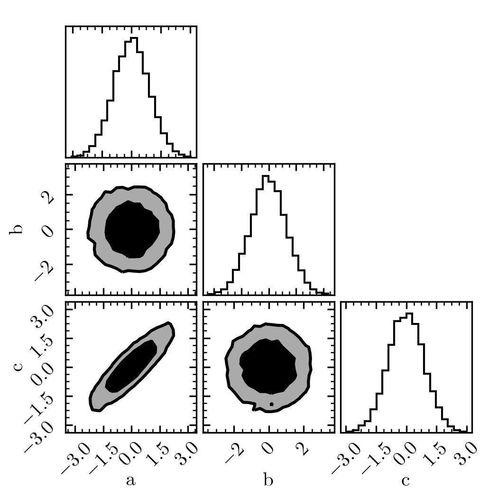

Crash Course
============

The best way to get started with ``nautilus`` is to apply it to a problem.
Here, we give a minimal example of how to use the code to estimate parameter
posteriors as well as the Bayesian evidence :math:`\mathcal{Z}`.

In this simple example, our "model" has three parameters: :math:`a`, :math:`b`
and :math:`c`. Furthermore, let's assume flat priors for :math:`a` and
:math:`b` in the range :math:`[-5, +5]` and a Gaussian prior for :math:`c` with
:math:`0` mean and :math:`2` scatter. The priors can be specified as follows.

.. code-block:: python

    from scipy.stats import norm
    from nautilus import Prior

    prior = Prior()
    prior.add_parameter('a', dist=(-5, +5))
    prior.add_parameter('b', dist=(-5, +5))
    prior.add_parameter('c', dist=norm(loc=0, scale=2.0))

The next step is to define the likelihood. For simplicity, let's assume that
all three parameters have zero mean and unit variance but that :math:`a` and
:math:`c` have a correlation coefficient of :math:`0.9`.

.. code-block:: python

    import numpy as np
    from scipy.stats import multivariate_normal

    def likelihood(param_dict):
        x = np.array([param_dict['a'], param_dict['b'], param_dict['c']])
        return multivariate_normal.logpdf(
            x, mean=np.zeros(3), cov=[[1, 0, 0.90], [0, 1, 0], [0.90, 0, 1]])

Now, we are ready to run the sampler.

.. code-block:: python

    from nautilus import Sampler

    sampler = Sampler(prior, likelihood)
    sampler.run(verbose=True)

At this point, we can for example plot the posterior using the handy ``corner``
Python package.

.. code-block:: python

    import corner
    import matplotlib.pyplot as plt

    points, log_w, log_l = sampler.posterior()
    ndim = points.shape[1]
    fig, axes = plt.subplots(ndim, ndim, figsize=(3.5, 3.5))
    corner.corner(points, weights=np.exp(log_w), bins=20, labels=prior.keys,
                  plot_datapoints=False, plot_density=False,
                  fill_contours=True, levels=(0.68, 0.95),
                  range=np.ones(ndim) * 0.999, fig=fig)

The Bayesian evidence :math:`\log \mathcal{Z}` has also been estimate during
the run.

.. code-block:: python

    print('log Z: {:.2f}'.format(sampler.evidence()))

Output::

    log Z: -6.34